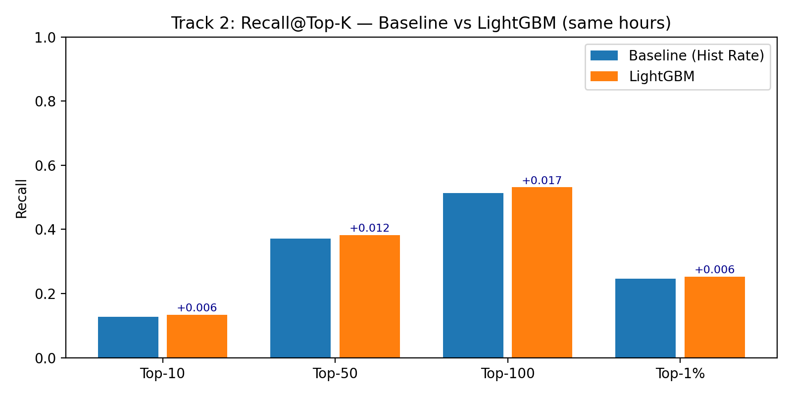

# emergency-response-placement

Where should California put its emergency response centers, and where should responders look in the next hour?

The project uses 1.7M California traffic accidents to answer two questions:

1. **Placement.** Choose *k* response-center sites that minimize severity-weighted travel time on the real road network.
2. **Hourly risk.** Rank every ~11 km grid cell by how likely an accident is there in the next hour, so a dispatcher with limited attention knows where to look.

An interactive dashboard puts both in front of a planner: **[live demo](https://erc-dashboard.onrender.com)**. It's on a free host, so the first load can take about a minute to wake up.

## Results

**Placement: optimizing travel time beats clustering on a map.** A severity-weighted p-median on road-network travel times, compared with severity-weighted k-means on latitude and longitude:

| Sites (k) | Method | Weighted mean travel time | Demand reached in 15 min |
|---|---|---|---|
| 10 | k-means | 33.4 min | 23.0% |
| 10 | **p-median** | **26.1 min** | **37.5%** |
| 100 | k-means | 11.0 min | 83.9% |
| 100 | **p-median** | **7.4 min** | **84.9%** |

Cluster centers look balanced on a map but ignore how roads actually connect. Optimizing travel time directly cut mean response time by 22% at k = 10. Full metrics are in [`dashboard/outputs/dashboard_erc_metrics.csv`](dashboard/outputs/dashboard_erc_metrics.csv).

**Hourly risk: ranking the top 4% of cells catches about half of accident locations.** The model trains on accidents before 2022 and is tested on 2022 onward, with no look-ahead. A LightGBM ranker adds recency and time-of-week features on top of a smoothed historical-rate baseline:

| Cells checked each hour | Baseline recall | LightGBM recall |
|---|---|---|
| Top 10 | 12.8% | 13.4% |
| Top 50 | 37.1% | 38.2% |
| Top 100 (~4% of the grid) | 51.4% | **53.1%** |



The gain over the baseline is small. Where accidents happen is mostly explained by where they happened before, and the model's most important features confirm it: the cell's historical rate, the rate for that hour of the week, and the neighboring cells' rate. The honest takeaway is that a simple, explainable baseline gets most of the way.

## Data and its limits

[US Accidents (2016–2023)](https://www.kaggle.com/datasets/sobhanmoosavi/us-accidents) by Sobhan Moosavi et al., licensed CC BY-NC-SA 4.0. The raw files (~3 GB) aren't in this repo. Download them from Kaggle and run `pipeline/`.

Before modeling, the data audit showed what the dataset *can't* support:

- **Coverage grew over time.** Records rise more than 4× from 2016 to 2022 because sensor and API coverage expanded, not because accidents did. That rules out year-over-year trend claims.
- **Records follow sensors, not crashes.** California's 22.5% share of the data reflects where sensors are dense, and rural roads are under-counted.
- **Severity labels vary by source.** Source1 labels about 90% of records Severity 2, while Source2 labels only about 65% that way. Severity is used as a weight, not as a prediction target.
- **Duration is often hard-coded.** Many end times are exactly start + 30 min, so duration isn't analyzed.

## Repository

```
pipeline/01_clean.py               clean the national file, drop high-missing columns
pipeline/02_filter_california.py   keep California records
notebooks/01_baselines.ipynb       data audit, k-means placement baseline, first risk baseline
notebooks/02_risk_model.ipynb      grid, features, LightGBM ranker, Recall@Top-K evaluation
risk_model/                        scripts that rebuild the dashboard's risk tables
dashboard/                         Dash app (app.py) and the precomputed outputs it reads
results/                           model metrics and figures
```

The p-median solver ran separately on road-network travel times. This repo includes its solutions and metrics (`dashboard/outputs/dashboard_erc_*.csv`), and the solver code will be added once it's located.

## Run the dashboard

```bash
cd dashboard
pip install -r requirements.txt
python app.py            # or: gunicorn app:server
```

The dashboard reads only the precomputed files in `dashboard/outputs/`, so it runs without the raw data. `render.yaml` deploys it to Render as-is.

---

Team project for UC Berkeley's Analytics Lab course, Spring 2026.
